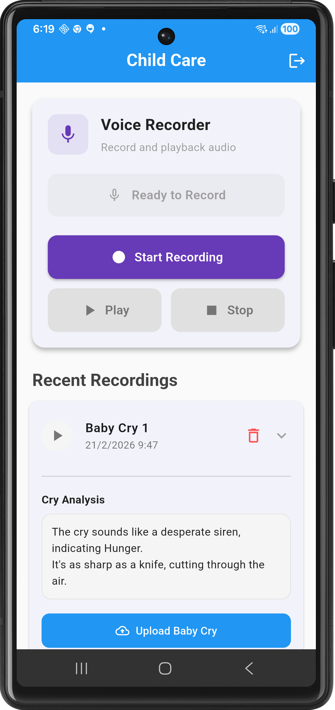

# Child Care

Child care (AI initiative) is a mobile app that is developed in flutter. It is a app which used a child cryping voice and  it predict what are the reason of child cry. It uses **librosa library** to extract features from the audio and then uses a pre-traineed **llama-3.3-70b-versatile** model to predict the reason of child cry

---

## 🚀 Getting Started

Child care is a mobile app that is developed in flutter. it records the child cry and send to server for processing. The server is using the **librosa library** to extract features from the audio and then uses a pre-traineed **llama-3.3-70b-versatile** model to predict the reason of child cry.

librosa library is a python library which is used to extract average pitch, average volume and average frequency from the audio and give it to the **llama-3.3-70b-versatile** model to predict the reason of child cry.

The model return the summary in the text format which is saved in the backend and show in the app through api.

### App Interface Overview

## Usages

App focus the newly made parents which don't have any idea about the child cry and what are the reason of child cry.

## 📺 Video Demo

> Seeing is believing! Watch the video below.
>
## 💼 Business & Partnership

Are you looking to scale this solution? We offer professional services for:

- **White-labeling:** Custom-branded versions of the Child Care app.

### Get in Touch

- 📧 **Email:** [rajendrarajaramv@gmail.com](mailto:rajendrarajaramv@gmail.com)
- 🌐 **Portfolio:** [iamrajendraverma.github.io](https://iamrajendraverma.github.io)
- 👔 **LinkedIn:** [Connect on LinkedIn](https://linkedin.com/in/rajendrarajaramv)

---
