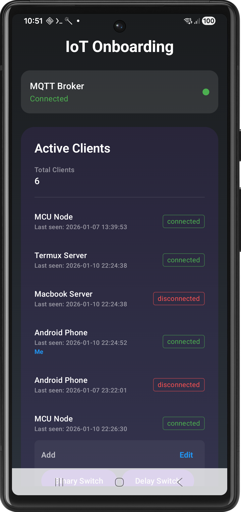
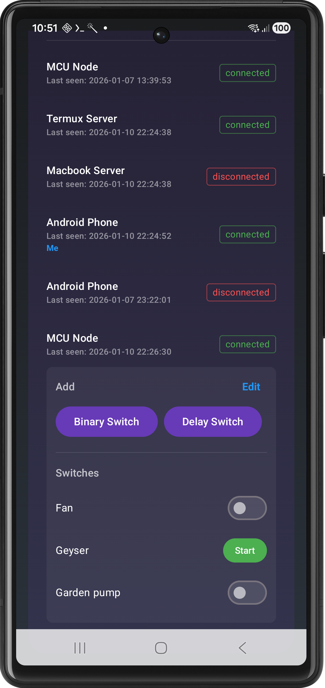
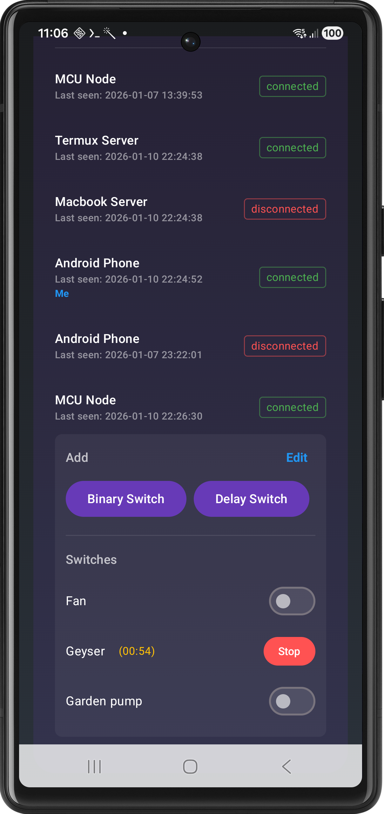
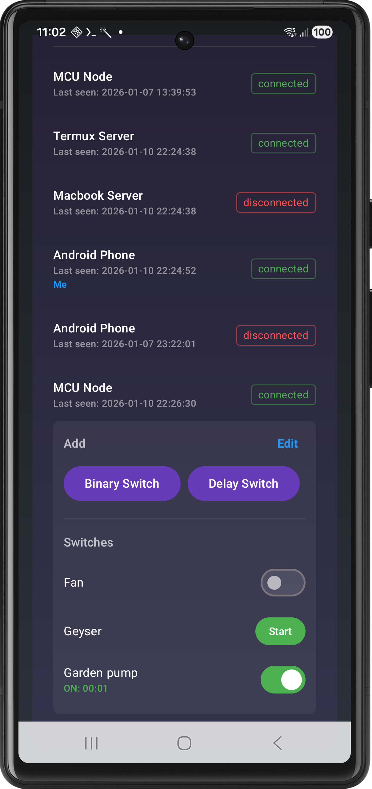

# 📱 ESP Buttons: Complete Feature Guide

Welcome to the **ESP Buttons** ecosystem! This comprehensive guide will walk you through the powerful features and intelligent switch types available in the app, designed to bring seamless automation to your smart environment.

---

## 🚀 Getting Started

The ESP Buttons app is your central hub for managing IoT devices. Before diving into the specific switch types, let's look at the primary interface where you'll spend most of your time.

### App Interface Overview

The dashboard provides a real-time status of all your connected devices (clients). From here, you can monitor connectivity, add new switches, and manage existing ones with ease.

---

## ⚡ Smart Switch Types

We offer three distinct switch types, each tailored for specific automation needs.

### 1️⃣ Binary Switch

*The classic control, redefined.*

The **Binary Switch** provides instant, manual control over any connected device. It mimics a physical switch but adds digital reporting.

| Feature | Description |
| :--- | :--- |
| **Instant Toggle** | Tap to turn ON/OFF with zero latency. |
| **Usage Tracking** | Displays a real-time elapsed timer while the device is ON. |
| **Feedback** | Visual confirmation of the current state across all connected apps. |

**Best For:** Lights, fans, or any appliance where you need simple manual control and want to track usage.

---

### 2️⃣ Delay Switch (Timer-Based)

*Set it and forget it.*

The **Delay Switch** is perfect for devices that should only run for a fixed duration. It prevents energy waste and ensures safety.

* **How to use:** Tap "Start", set your desired duration (HH:MM:SS), and let the app handle the rest.
* **Automatic Shut-off:** The device turns OFF exactly when the countdown reaches zero.
* **Visual Countdown:** Stay informed with a live countdown timer on your dashboard.

**Best For:** Electric vehicle charging, bathroom exhaust fans, or water pumps.

---

### 3️⃣ Interval Switch (Scheduled)

*Ultimate Automation.*

The **Interval Switch** allows you to schedule operations in advance. It supports two powerful modes:

#### 🕒 Once Mode

Set a "Start After" delay and a "Duration". The device will wait for the specified delay, turn ON for the duration, and then turn OFF.
*Example: Start the washing machine in 30 minutes for a 1-hour cycle.*

#### 📅 Daily Mode

Schedule a specific time (e.g., 06:00 AM) and a duration. The task repeats every single day.
*Example: Water your garden every morning for 15 minutes.*

| Mode | Trigger | Best Use Case |
| :--- | :--- | :--- |
| **Once** | Countdown Delay | One-time delayed tasks |
| **Daily** | Specific Clock Time | Recurring daily routines |

  
  

---

## 🎙️ Voice Assistant Integration

Take your automation to the next level with hands-free control. The ESP Buttons ecosystem is fully compatible with **Amazon Alexa** via **Node-RED**.

* **Seamless Bridge**: Use Node-RED to connect your MQTT devices to the Alexa ecosystem.
* **Voice Control**: Simply say *"Alexa, turn on the water pump"* or *"Alexa, turn off the bedroom lights."*
* **Smart Routines**: Integrate your custom ESP hardware into your existing smart home routines for complete automation.

---

## 📺 Video Demo

> [!TIP]
> Seeing is believing! Watch the video below to see how easy it is to set up and use these switch types in real-time.

[**▶️ Watch the ESP Buttons Feature Tour**](https://example.com/demo-video-link)

---

## 💼 Business & Partnership

Are you looking to scale this solution? We offer professional services for:

* **White-labeling:** Custom-branded versions of the ESP Buttons app.
* **Bespoke hardware:** Proprietary relay controllers and IoT nodes.
* **System Integration:** End-to-end automation for hotels, vertical farming, and smart factories.

### Get in Touch

* 📧 **Email:** [rajendrarajaramv@gmail.com](mailto:rajendrarajaramv@gmail.com)
* 🌐 **Portfolio:** [iamrajendraverma.github.io](https://iamrajendraverma.github.io)
* 👔 **LinkedIn:** [Connect on LinkedIn](https://linkedin.com/in/rajendrarajaramv)

---
*Developed with passion for the IoT community.*

**© 2026 Rajendra Verma**
