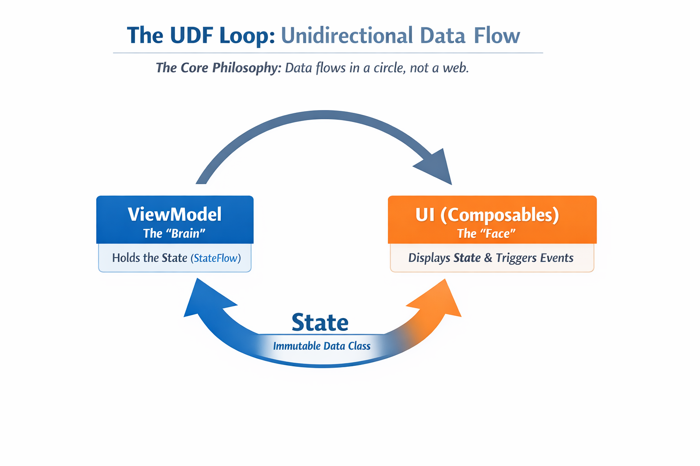
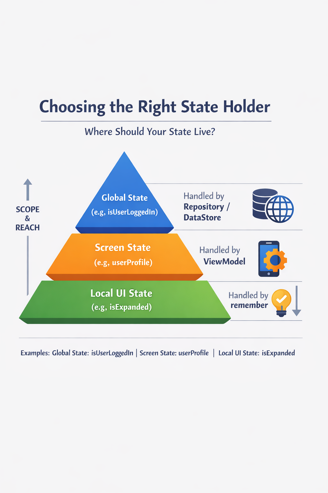
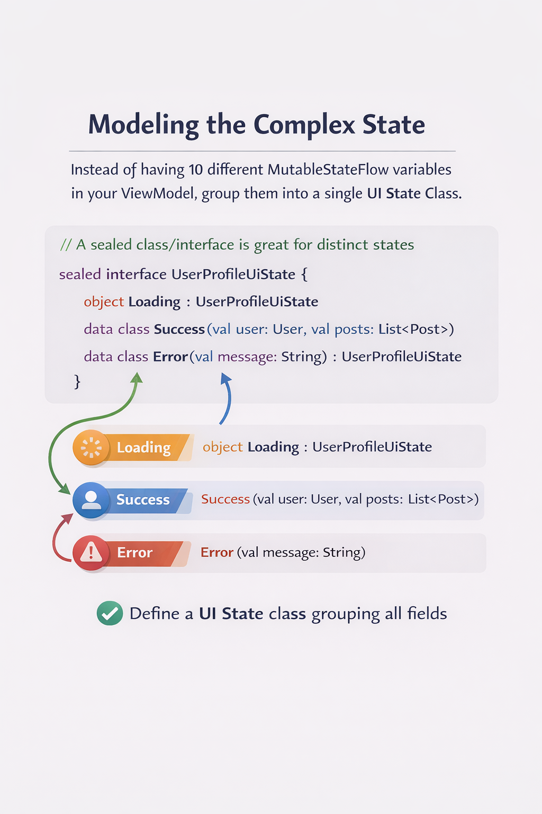

# State management in a complex jetpack compose applications

## Introduction

State management is the backbone of any Jetpack Compose app. In a simple app, a few `mutableStateOf` variables might do the trick, but as complexity grows, you need a structured strategy to prevent "state spaghetti" 🍝 —where data is hard to track, UI doesn't update correctly, and testing becomes a nightmare

## 1 . The Core Philosophy: Unidirectional Data Flow (UDF)

In complex apps, state should flow down and events should flow up. This ensures that there is a "Single Source of Truth," making the app predictable and easier to debug.

- **State**: The data that describes the UI (e.g., a list of users, a loading boolean).

- **Events**: User actions (e.g., button clicks, text input) that are sent to the logic layer to update the state.

<div align="center">

</div>

## 2. Chossing a right state holder

Different types of state belong in different places depending on their lifecycle and scope.

| Level | State Holder | Best For... |
| --- | --- | --- |
| UI Element | remember { mutableStateOf(...) } | Animation states, scroll position, or transient UI-only data. |
| Screen/Feature | ViewModel | Business data, screen-level state that survives configuration changes (like rotation). |
| App-wide | Repository or DataStore | User preferences, authentication status, or shared database state. |

<div align="center">

</div>

## 3. Modeling the complex state

Instead of having 10 different MutableStateFlow variables in your ViewModel, group them into a single UI State Class. This prevents "partial state updates" where the UI shows a loading spinner and data at the same time.

```kotlin
// A sealed class/interface is great for distinct states
sealed interface UserProfileUiState {
    object Loading : UserProfileUiState
    data class Success(val user: User, val posts: List<Post>) : UserProfileUiState
    data class Error(val message: String) : UserProfileUiState
}
```

<div align="center">

</div>

## 4. Hoisting and Scalability Patterns

Think of Hoisting and Scalability as the difference between keeping your car keys in your pocket (where only you can use them) versus hanging them on a hook by the door (where anyone in the family can find and use them).

In Jetpack Compose, "hoisting" is just a fancy word for moving a piece of data to a higher level so it can be shared or controlled more easily.

- **State Hoisting**

Move state to caller to make a composable "stateless". This makes your UI components higly reusable and  easy to preview in Android Studio.

- **The State Holder class**

For Complex UI logic (liek a map interface or a multi-step form) that doesn't belonging in a ViewModel but is too heavy for a a composable function, create a plain classs:

`class Myfeatues (val scrollState:ScrollState)`

- **Cold vs Hot Flows**

- `State flow`: Always has a value . Perfect for UI state becuase UI always needs a something to display.
- `SharedFlow` / `Channel`: Great for one-time events like showing a snackbar or navigation, where you don't want the event to be repeated if the user rotates the screen.

Exactly. This is a critical distinction for building a professional-grade app. If you use `StateFlow` for a Snackbar, and the user rotates their phone, the "latest state" is still "Show Snackbar," so the message pops up again. `SharedFlow` or `Channels` fix this because they are event-driven, not state-driven.

|Tool|Behavior|Best Use Case
|---|---|---|
|SharedFlow|Can have multiple listeners. If no one is listening, the event is dropped (by default).|General UI events that multiple parts of a screen might care about.
Channel|Strict 1-to-1 communication. One sender, one receiver. If no one is listening, it ""buffers"" (waits) until someone connects.|Navigation & Snackbars. It ensures the event is handled exactly once, even if the UI is temporarily busy."

## 5. Performance Optimization

In the large application, unnecessary recomposition can lead to performance issues. To avoid this, use the following techniques:

- `derivedStateOf`: Use this when you need to calculate a new state based on existing state. It prevents unnecessary recomposition when the underlying state changes.
- `rememberUpdatedState`: Useful in  `LaunchedEffect`  to ensure you 're using the latest value without restarting the effect.

**Pro-Tip: The "Compose -Stability" Rule**

If you pass a complex List or a class from a different module into a Composable, Compose might not realize the data hasn't changed and will re-render it anyway. Using @Immutable or @Stable annotations on your data classes can significantly boost performance in complex hierarchies.
