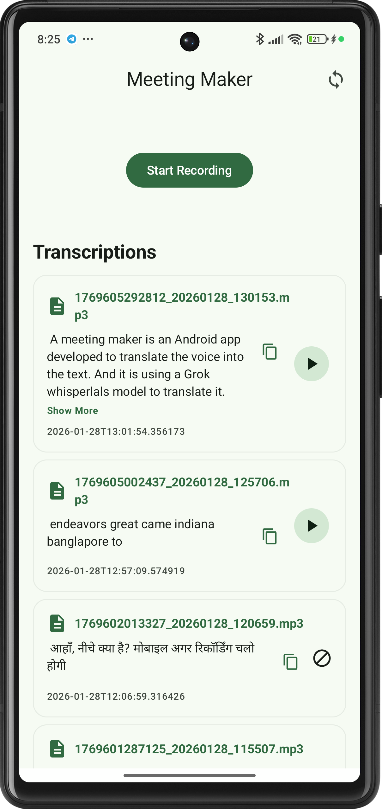
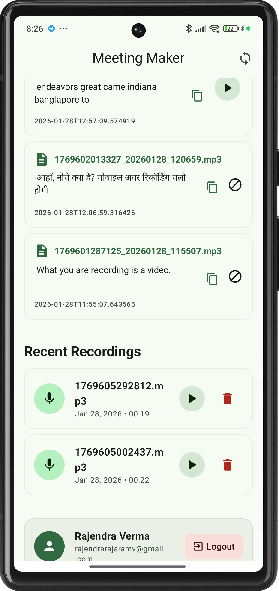
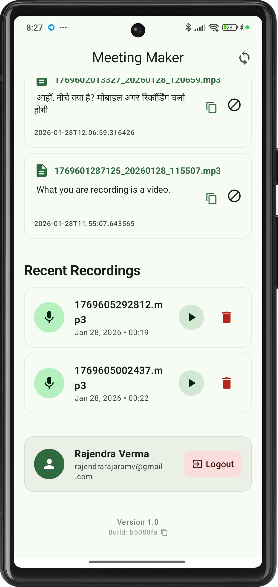

# Meeting Maker 📱

Meeting Maker(AI initiative) is a android app that records the meeting and converts the audio to text using cloud transcription services.
It will also generate the summary of the meeting and provide the action items.

---

## 🚀 Getting Started

The meeting maker app  is doing the recording of the meeting  and send it to the server for processing. The server is using the cloud transcription services to convert the audio to text and generate the summary of the meeting. **whisper-large-v3-groq** is used for transcription and in the next version we will use **LLM** to generate the summary of the meeting.

### App Interface Overview

Dasboard is the main screen of the app. It has the following features:

- Record Meeting
- Transcription list
- Recording list  
- Logout
- Offline mode
- Manual syncing
- Auto syncing
- Footer with version and build number

## 📺 Video Demo

> Seeing is believing! Watch the video below.

[**▶️ Watch the Meeting Maker Demo**](https://example.com/demo-video-link)

## 💼 Business & Partnership

Are you looking to scale this solution? We offer professional services for:

- **White-labeling:** Custom-branded versions of the Meeting Maker app.

### Get in Touch

- 📧 **Email:** [rajendrarajaramv@gmail.com](mailto:rajendrarajaramv@gmail.com)
- 🌐 **Portfolio:** [iamrajendraverma.github.io](https://iamrajendraverma.github.io)
- 👔 **LinkedIn:** [Connect on LinkedIn](https://linkedin.com/in/rajendrarajaramv)

---
*Developed with passion for the AI community.*

**© 2026 Rajendra Verma** | [Release Notes](rn_meeting_maker.md) | 📥 [Download Meeting Maker](https://appdistribution.firebase.google.com/testerapps/1:941011959406:android:08965a8ab1c7d32019f07f/releases/64jrinqpeuslo?utm_source=firebase-console)
