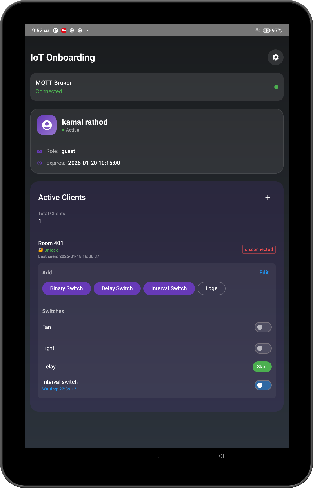
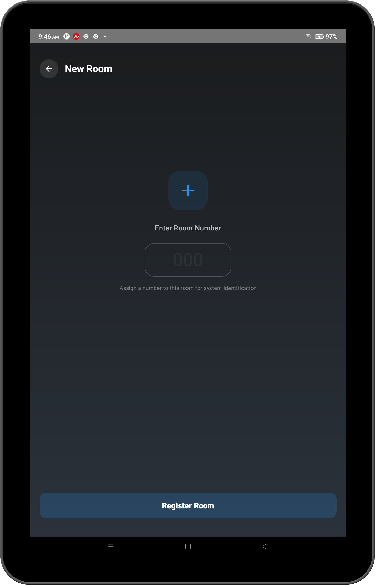
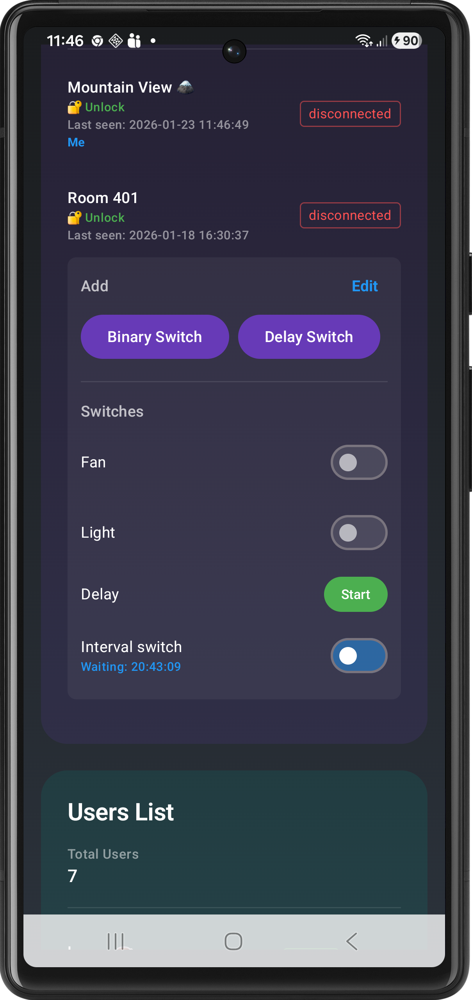
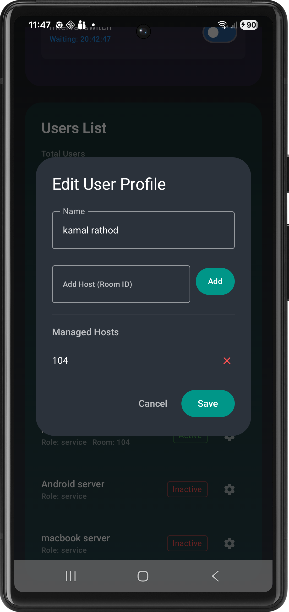
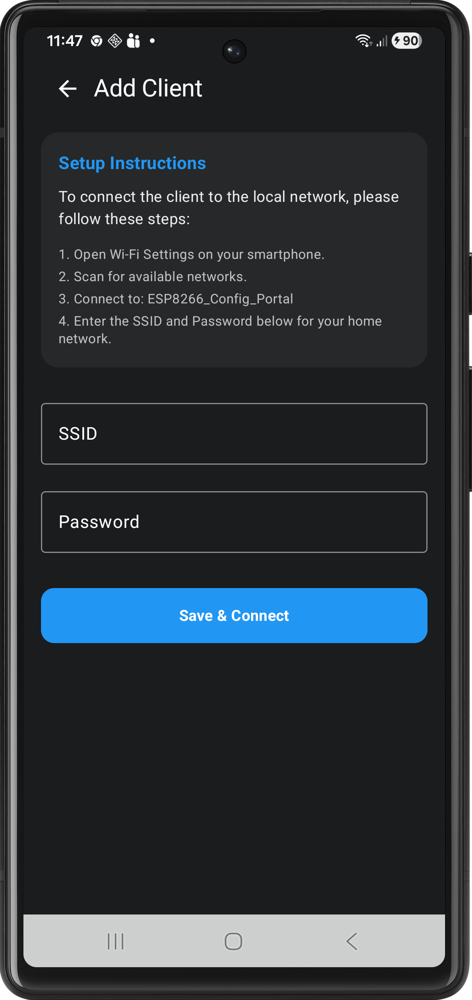
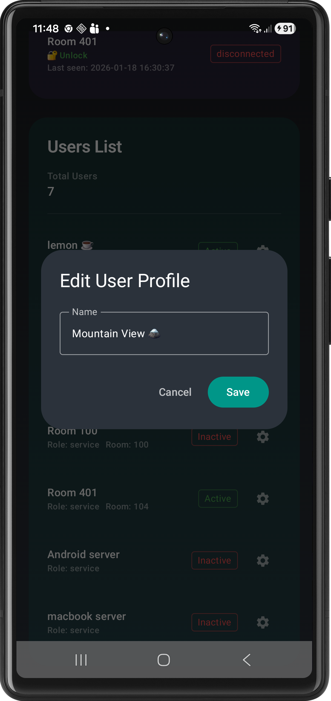
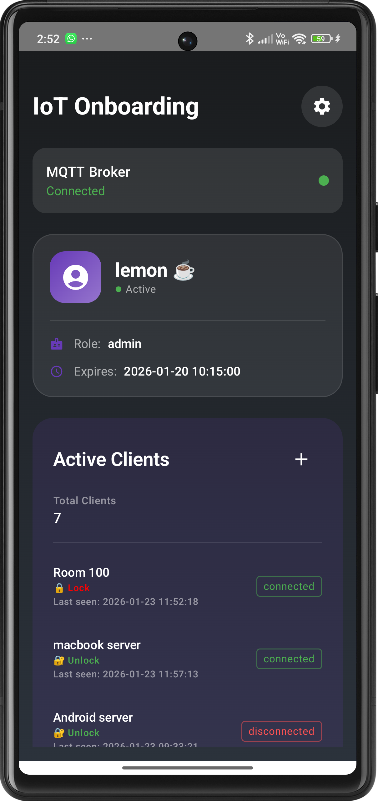
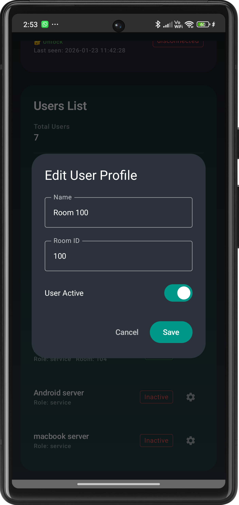
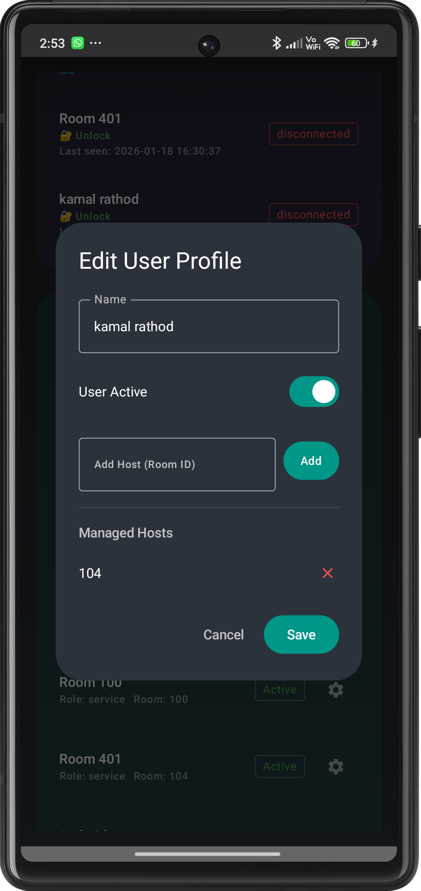
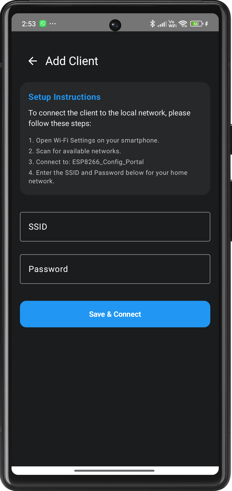

# Release Notes

## Version 1.0.0 (Initial Release)

We are excited to announce the first official release of the **ESP Button** app! This version brings powerful automation and real-time monitoring to your fingertips, allowing you to manage your devices with precision and ease.

### 🚀 Key Features

* **Versatile Switch Types**
  * **Binary Switch**: The classic digital toggle. Turn devices ON or OFF instantly. Includes a real-time Elapsed Timer.
  * **Delay Switch**: Configure a specific duration (HH:MM:SS) for your device to run. Auto-triggers OFF when complete.
  * **Interval Switch**: Advanced scheduling. "Once Mode" for delayed starts, "Daily Mode" for recurring cycles.

* **Real-Time MCU Status**
  * **Live Connectivity**: Instantly see if your ESP8266/MCU is online or offline.
  * **Sync Status**: Real-time feedback ensuring the app state matches your physical device state.
  * **Countdown Awareness**: Watch timers update live on your dashboard.

* **Premium Dashboard Experience**
  * **Multi-Client Support**: Manage multiple rooms or locations from a single interface.
  * **User-Centric UI**: Sleek, intuitive design built with Jetpack Compose.
  * **Easy Setup**: Streamlined process for adding and configuring new switches.

---

## Version 1.1.0 (Added a Hotel Management usages)

In the previous version we have introduce the types of ESP buttons (Binary Switch, Delay Switch, Interval Switch). In this version we have added a new feature to the app which allows users to manage their hotel rooms and devices from a single interface.

### 🚀 Key Features

* **Hotel Management**
  * **Room Management**: A guest can control the devices of their room from a single interface.
  * **Device Management**: A desk manager can control the guest device and room from a single interface.
  * **User Management**: An admin can control the guest and desk manager from a single interface.

### Room Management

* A guest can add control of room devices from its mobile using app.
* He/She can control the devices in their room using app.
* He/She can add  the switches control from its mobile using app.

### Screenshots

### Device Management

* A desk manager can add control of guest devices from its mobile using app.
* He/She can add and remove room switch control from from guest mobile.
* A desk manager can rename the devices in the network
* A desk manager can add a new switch controller

### Screenshots

### User Management

* Admin can do everything, he/she can active/deactive guest, desk manager and room switch.
* He/She can control the devices in their room using app.
* He/She can add and remove guest room switch control from guest mobile.
* He/She an enable or disable any device.
* He/She can rename any device.

### Screenshots

### 📥 Get Started

* Ensure your MCU is flashed with the compatible firmware and connected to your MQTT broker.
* Add your first device on the dashboard and start automating!
* *Feedback*: If you encounter any issues or have feature requests, please reach out via our support channels.
