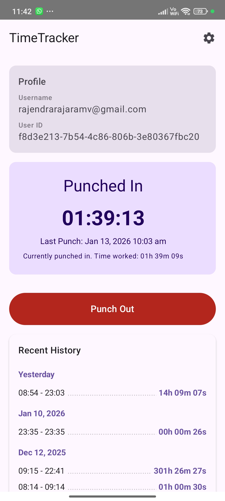
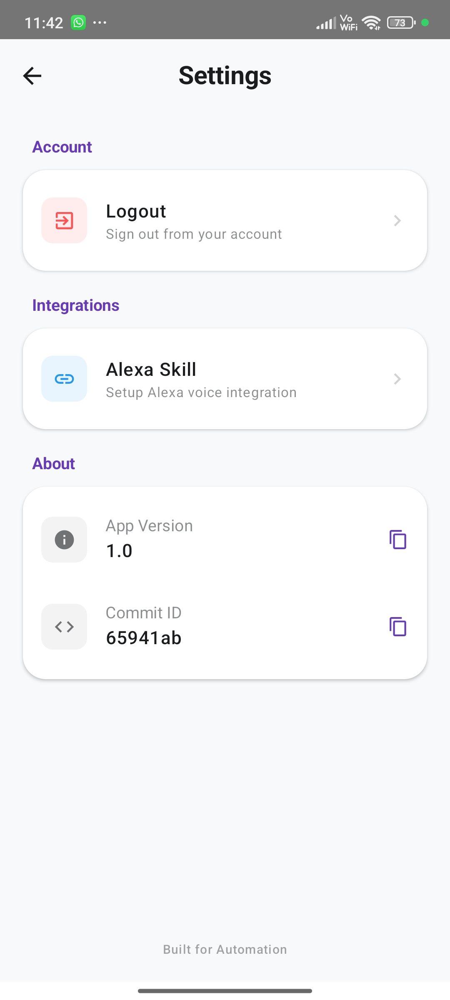
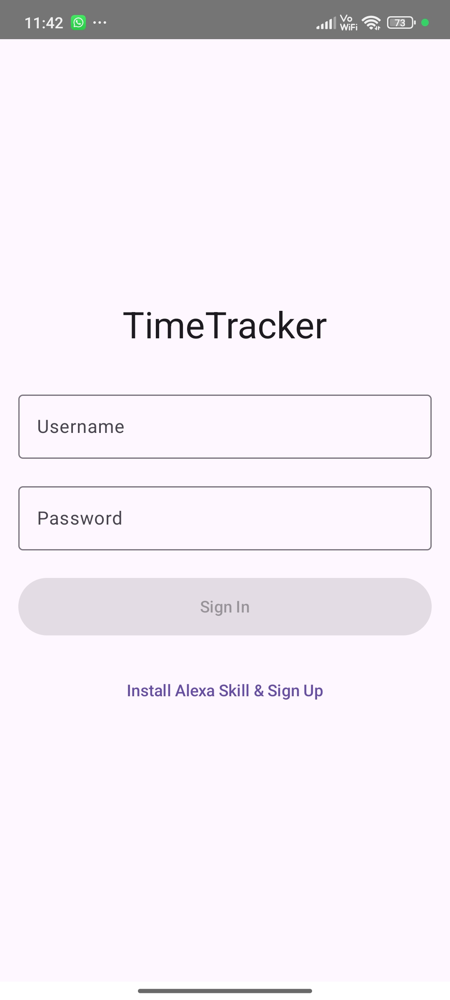
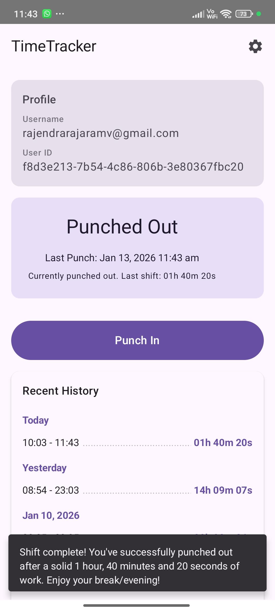
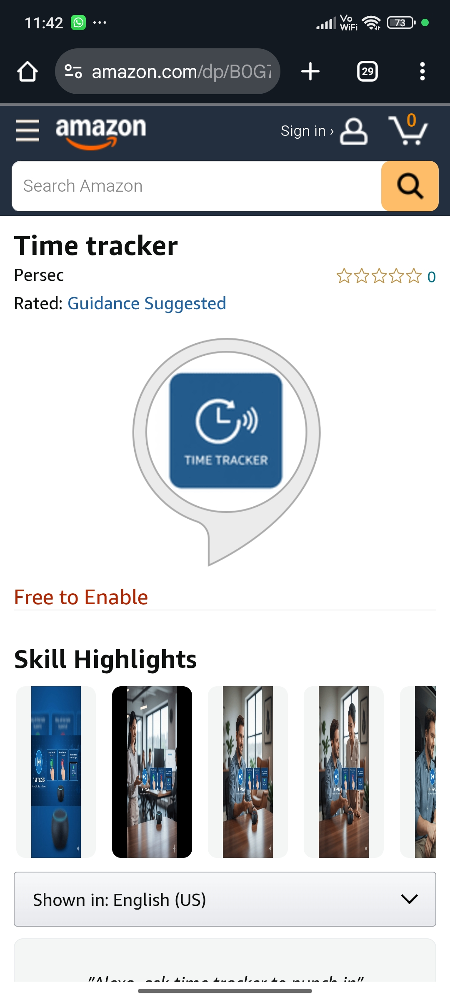

# Time Tracker App

**Time Tracker** is a smart Android application integrated with an Alexa skill, designed to make tracking your working hours working effortless. Whether you prefer using a mobile interface or voice commands, Time Tracker helps you stay on top of your schedule.

## Features

- **Smart Punch In/Out**: Easily start and stop your work timer with a single tap.
- **Alexa Integration**: Use voice commands to punch in, punch out, and ask for your tracking status.
- **Real-Time Clock**: View a live timer showing exactly how much time you have spent checked in for the current session.
- **Work History**: meaningful insights into your past working hours and sessions.

## Gallery

### App Interface

Here you can see the intuitive design of the Time Tracker app:

<!-- Add your app screenshots below this line -->

### Alexa Integration in Action

Watch how easy it is to control Time Tracker with your voice:

<!-- Add your video snaps or gifs below this line -->

## Get Started

### Download Android App

Experience the app on your Android device. Download the latest build directly via Firebase App Distribution:

[**Download from Firebase App Distribution**](https://appdistribution.firebase.google.com/testerapps/1:941011959406:android:d0e162ecd4f4dac119f07f/releases/4q32jf5j41kvg?utm_source=firebase-console)

### Enable Alexa Skill

Install the skill directly to your Alexa account to start using voice commands:

[**Install Alexa Skill**](https://www.amazon.com/dp/B0G7GFNGNG)
